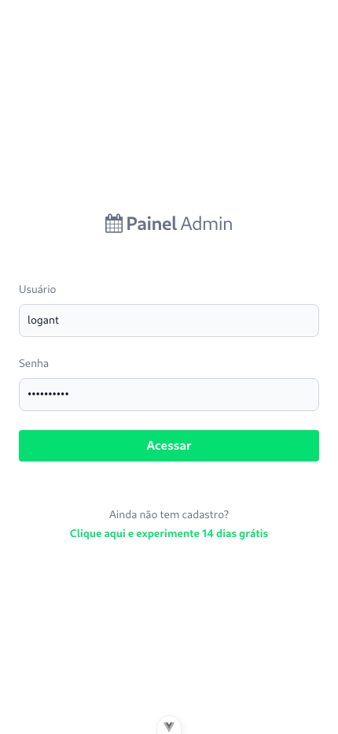
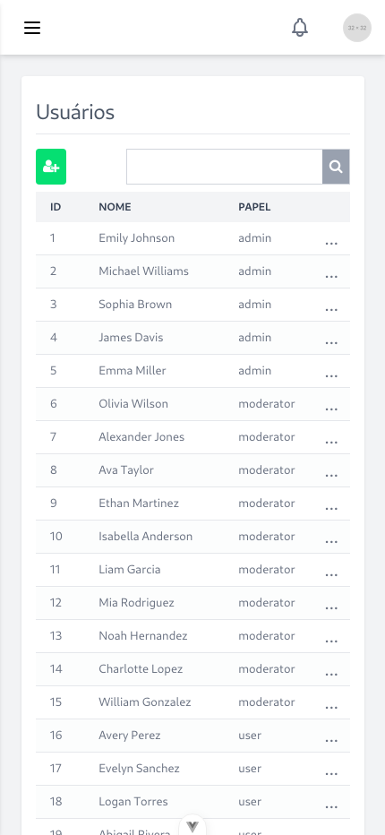
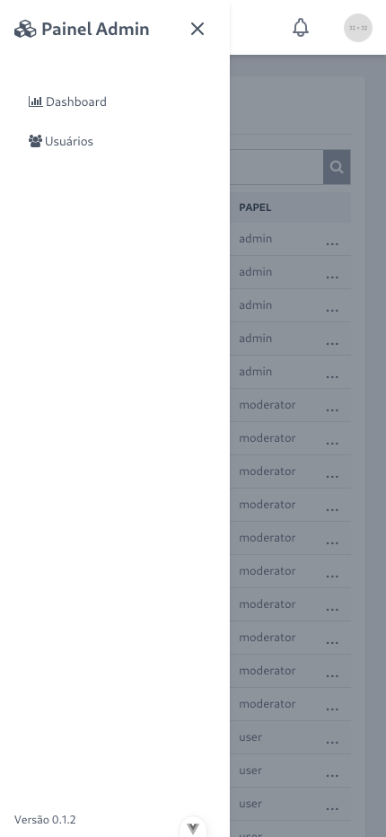
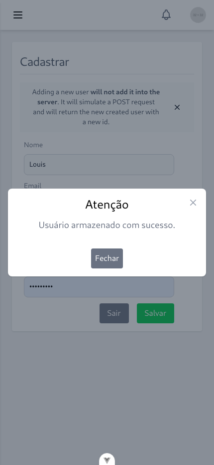

# Painel Admin - VueJs 3

Um painel administrativo **genérico, responsivo e moderno**, desenvolvido com **Vue.js 3**, **Vite**, **Pinia** e **TailwindCSS**.  
O projeto possui tela de **login**, **listagem de usuários** e **integração com API pública (dummyjson)**, simulando o fluxo real de autenticação e consumo de dados.

---

## Demonstração

> [🔗 Clique aqui para ver a demo online](https://seu-link-deploy.vercel.app)

| Tela de Login | Dashboard de Usuários |
|----------------|-----------------------|
|  |  |

| Menu mobile | Modal |
|----------------|-----------------------|
|  |   |

---

## Tecnologias Utilizadas

- [Vue.js 3 (Composition API)](https://vuejs.org/)
- [Vite](https://vitejs.dev/)
- [TailwindCSS](https://tailwindcss.com/)
- [Axios](https://axios-http.com/)
- [DummyJSON API](https://dummyjson.com/)
- [Vue Router](https://router.vuejs.org/)
- [Pinia](https://pinia.vuejs.org/)

---

## Funcionalidades

✅ Tela de Login com autenticação simulada via API  
✅ Página de Listagem de Usuários (com busca e paginação)  
✅ Layout totalmente responsivo (mobile first)  
✅ Componentes reutilizáveis e organizados  
✅ Estrutura preparada para expansão (rotas, middlwares, módulos, etc.)
---

## Estrutura do Projeto

```bash
src/
├── assets/           # Imagens, ícones e recursos estáticos
├── components/       # Componentes reutilizáveis (Input, Modal, etc.)
├── layouts/          # Layout principal do painel
├── views/            # Telas do sistema (Login.vue, Users.vue)
├── router/           # Configuração das rotas
├── middlewares/      # Códigos intermediários que são executados ao acessar uma determinada da aplicação.
├── services/         # Requisições HTTP (ex: AuthService.js, UserService.js)
├── store/            # Pinia
├── main-style.css    # Folha de estilo principal da aplicação
└── main.ts           # Arquivo principal da aplicação
```

---
# Autor

### Mauro Vieira
#### Desenvolvedor Fullstack (PHP • Laravel • Vue.js • MySQL • Linux)
📫 [LinkedIn](https://www.linkedin.com/in/mauro-vieira-1a5809a8/) | [Portfólio](https://github.com/mvsjunior) | [GitHub](https://github.com/mvsjunior)